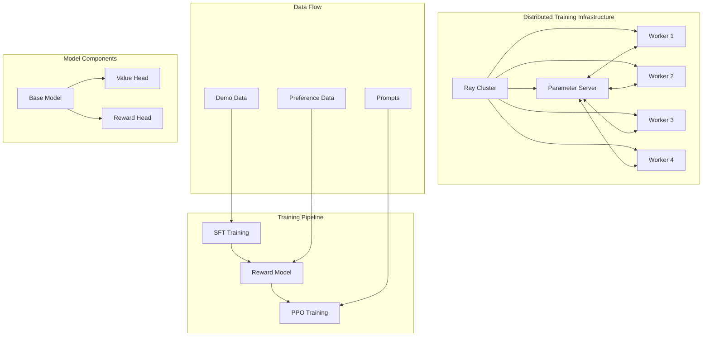
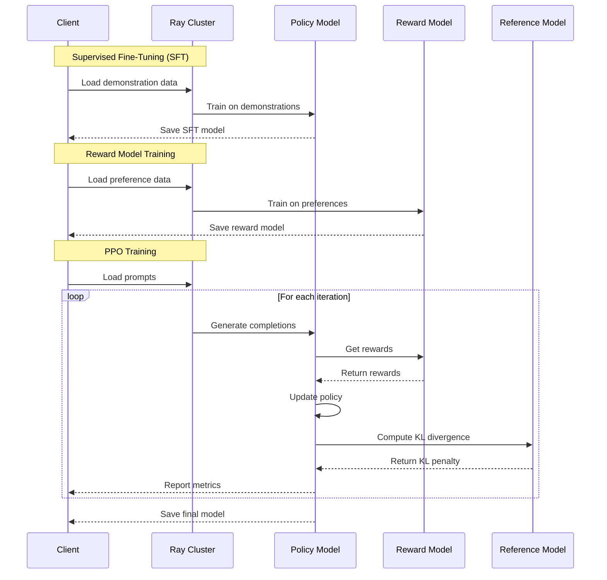
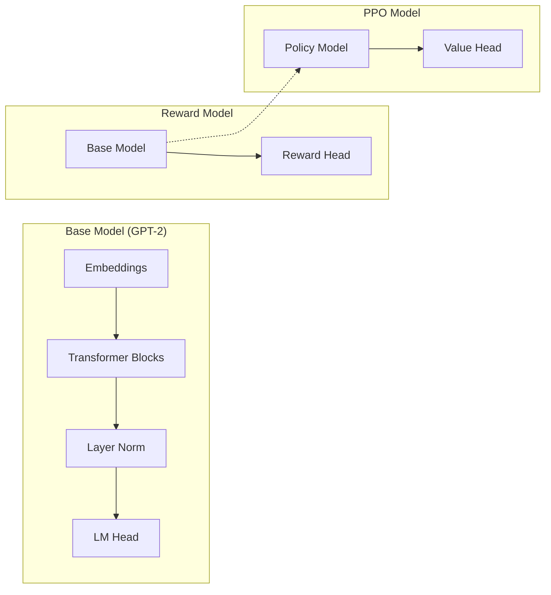

# Distributed Reinforcement Learning for LLMs

This project implements a distributed reinforcement learning (RLHF) system for training large language models (LLMs), similar to approaches used by organizations like Anthropic and OpenAI. The system leverages Ray for distributed computing and PyTorch for the underlying machine learning operations.

## Features

- **Complete RLHF Pipeline**: Implements the full RLHF training workflow:
  - Supervised Fine-Tuning (SFT)
  - Reward Model Training
  - Reinforcement Learning with PPO
- **Distributed Training**: Scale across multiple nodes using Ray
- **Modular Architecture**: Easily extend or modify components
- **Built-in Monitoring**: Track training progress with visualization tools
- **Configurable**: Customize training parameters via YAML configs

## System Architecture

The system consists of several key components:

1. **Model**: Transformer-based LLM architecture (GPT-2 style)
2. **RLHF Pipeline**: Three-stage training process
   - Supervised Fine-Tuning with demonstration data
   - Reward Model Training with preference pairs
   - Policy Optimization with PPO
3. **Distributed Training**: Ray-based infrastructure for distributed computing
   - Parameter Server Architecture
   - Distributed Data Parallel Training
4. **Data Management**: Efficient data loading and preprocessing



The RLHF training process follows this sequence:



The model architecture is built on a GPT-2 base with specialized heads:



## Project Structure

```
.
├── configs/             # Configuration files for models and training
├── data/                # Data storage and preprocessing scripts
├── scripts/             # Training and evaluation scripts
├── src/                 # Source code
│   ├── model/           # Model architecture definitions
│   ├── trainer/         # Training loops and optimizers
│   ├── distributed/     # Distributed computing infrastructure
│   └── utils/           # Utility functions and helpers
├── setup.py             # Package installation script
└── README.md            # Project documentation
```

### Prerequisites

- Python 3.7+
- CUDA-compatible GPU (recommended)

### Setup


   Install the package and dependencies:
   ```bash
   pip install -e .
   ```

   This will install all required dependencies from `requirements.txt`.

## Usage

### Quick Start with Example Script

The easiest way to get started is to use the example script:

```bash
# Create dummy data and run a small training job
python scripts/example.py --create_dummy_data

# Use custom configuration files
python scripts/example.py --config configs/my_model_config.yaml --dist_config configs/my_distributed.yaml
```

### Running a Full Training Pipeline

For a complete training run:

```bash
# Run the full RLHF pipeline
python scripts/train.py --config configs/model_config.yaml --sft_data path/to/sft_data.json --preference_data path/to/preference_data.json --prompt_data path/to/prompt_data.json

# Run individual stages
python scripts/train.py --config configs/model_config.yaml --stage sft --sft_data path/to/sft_data.json
python scripts/train.py --config configs/model_config.yaml --stage reward --preference_data path/to/preference_data.json
python scripts/train.py --config configs/model_config.yaml --stage rlhf --prompt_data path/to/prompt_data.json
```

### Monitoring Training Progress

Use the monitoring script to visualize training metrics:

```bash
python scripts/monitor.py --log_dir ./outputs/logs --plot_type all
```

### Evaluating Trained Models

Evaluate your trained models with the evaluation script:

```bash
python scripts/evaluate.py --config configs/model_config.yaml --model_dir ./outputs --eval_type all --test_data path/to/test_data.json
```

## Configuration

The system uses YAML configuration files to specify model architecture, training parameters, and distributed settings. Example configuration files are provided in the `configs/` directory:

- `model_config.yaml`: Model architecture and training hyperparameters
- `distributed.yaml`: Ray cluster configuration and fault tolerance settings

## Data Format

The system supports the following data formats:

1. **SFT Data**: JSON files with prompt-completion pairs
   ```json
   [
     {"prompt": "Question: What is...", "completion": "Answer: ..."},
     ...
   ]
   ```

2. **Preference Data**: JSON files with chosen-rejected pairs
   ```json
   [
     {"prompt": "Question: ...", "chosen": "Good answer", "rejected": "Bad answer"},
     ...
   ]
   ```

3. **Prompt Data**: JSON files with prompts for RLHF
   ```json
   [
     {"prompt": "Question: ..."},
     ...
   ]
   ```
